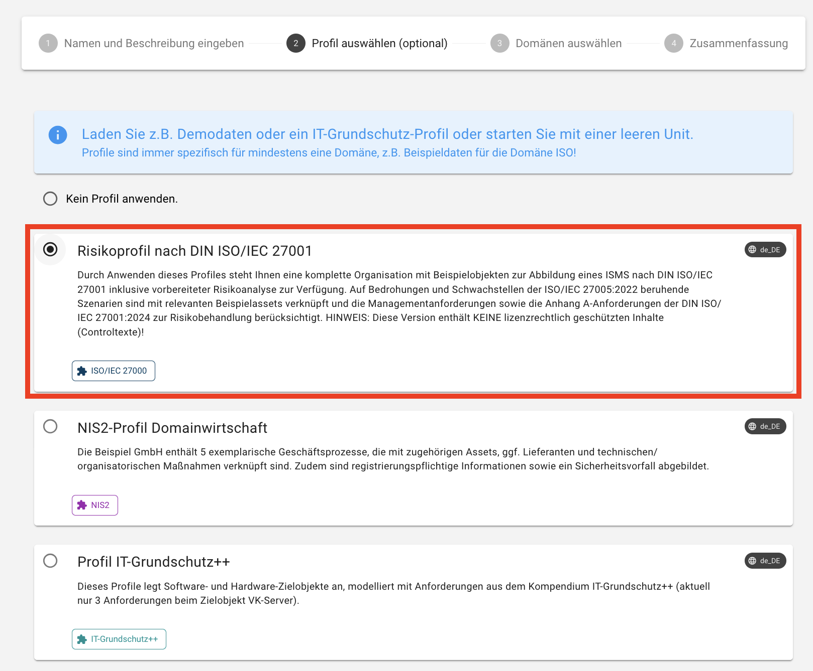
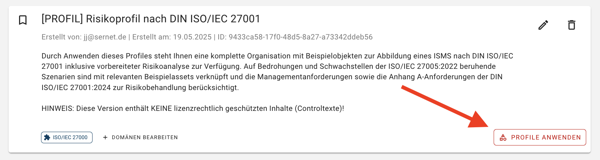

<!-- © 2025 The Project Contributors - see AUTHORS.txt -->
# Profil in der Domäne ISO/IEC 27000

## Arbeiten mit Risikoprofil nach DIN ISO/IEC 27001

Ein **Profil** ist eine vordefinierte Zusammenstellung von Beispielobjekten und bereits angewendeten Katalogelementen, die auf einem bestimmten **Katalog** basieren. Es erleichtert den Einstieg und die Konfiguration einer Unit, da viele erforderliche Objekte und Zusammenhänge bereits enthalten sind. Im Gegensatz zu einem Katalog, können mit einem Profil Zusammenhänge zwischen Objekten abgebildet werden.

Mit einem Profil können Sie eine komplette Beispielorganisation oder ein Risikoprofil gemäß der **DIN ISO/IEC 27001** laden und auf Ihre Unit anwenden – inklusive der zugehörigen Scopes, Assets, Prozesse, Bedrohungen, Personen, Schwachstellen und Sicherheitsmaßnahmen.

## Vorteile von Risikoprofil nach DIN ISO/IEC 27001

Profile bieten Ihnen folgende Vorteile:

- **Schneller Einstieg:** Sie erhalten eine strukturierte Ausgangsbasis für Ihr ISMS.
- **Zeitersparnis:** Viele Elemente sind bereits vorkonfiguriert – kein manuelles Anlegen notwendig.
- **Standardsicherheit:** Die Inhalte orientieren sich an den anerkannten Normen wie der ISO/IEC 27001 und ISO/IEC 27005.
- **Vereinfachte Bearbeitung:** Die Profile beinhalten typische Objekte, Beziehungen und Controls, die Sie direkt an Ihre Organisation anpassen können.
- **Effiziente Risikoanalyse:** Basierend auf Bedrohungen und Schwachstellen gemäß **ISO/IEC 27005** sind zahlreiche Szenarien vordefiniert. Diese dienen als potentielle Risiken und sind bereits mit typischen **Assets** verknüpft. Zudem sind passende, risikomitigierende Maßnahmen aus **Anhang A der ISO/IEC 27001** zugeordnet, was den Aufwand für die Risikoerfassung und -bewertung erheblich reduziert.

## Inhalte des ISO/IEC 27001-Profils

Das ISO/IEC 27001-Profil stellt beispielhafte Objekte aus folgenden Bereichen bereit:

- Organisation-Struktur
- ISMS-Geltungsbereich & Scopes
- Externe Dienstleister
- Geschäftsprozesse
- Assets
- Personen
- Informationssicherheitsvorfälle
- Dokumente & Aufzeichnungen
- Controls: Sicherheitsmaßnahmen und Anforderungen der DIN ISO/IEC 27001
- Szenarien: Bedrohungen und Schwachstellen nach ISO/IEC 27005

## Anwenden eines Risikoprofils nach DIN ISO/IEC 27001

Ein Profil kann in zwei Situationen angewendet werden:

1. **Beim Erstellen einer neuen Unit**: Während des Erstellungsprozesses können Sie ein Profil auswählen, das direkt auf die neue Unit angewendet wird. Navigieren Sie dazu oben links im Menü auf das Drop-Down-Menü **Unit auswählen**, scrollen Sie ganz nach unten und wählen **Units verwalten**. Klicken Sie anschließend unten rechts auf Button **Unit erstellen** und wählen Sie im zweiten Schritt des Wizards aus, dass Sie das Risikoprofil nach DIN ISO/IEC 27001 anwenden wollen:

2. **Nachträglich für bestehende Units:** Auch nach der Erstellung einer Unit lässt sich das Risikoprofil nach DIN ISO/IEC 27001 nachträglich anwenden. Um erneut in die Unit-Verwaltung zu gelangen, können Sie alternativ auf das **verinice**-Logo klicken. Klicken Sie für die entsprechende Unit den Button **Profil anwenden** an, um das Profil auf eine bestehende Unit anzuwenden:

## Hinweis

Das Anwenden eines Profils überschreibt **keine bestehenden Daten**. Neue Objekte werden ergänzt, bereits vorhandene Strukturen bleiben erhalten.

Bitte beachten Sie:

- Bei den im Profil enthaltenen **Scopes**, **Geschäftsprozessen**, **Assets**, **Personen** und **Informationssicherheitsvorfällen** handelt es sich um **Beispieldaten**, die als Vorlage dienen. Diese sollten nach dem Anwenden des Profils individuell an die Gegebenheiten Ihrer Organisation angepasst werden.

- Die unter **Controls** enthaltenen Anforderungen entsprechen den Vorgaben der **DIN ISO/IEC 27001 (Anhang A)**. Sie stellen keine Beispiele dar, sondern normative Anforderungen, die im Rahmen Ihrer ISMS-Umsetzung angemessen berücksichtigt und umgesetzt werden müssen, um eine Konformität mit der Norm zu erreichen.

- Die enthaltenen **Bedrohungen und Schwachstellen** wurden aus der **ISO/IEC 27005** übernommen. Auf dieser Basis wurden **beispielhafte Szenarien** modelliert und mit relevanten Assets sowie Sicherheitsmaßnahmen verknüpft. Diese Szenarien dienen als Ausgangspunkt für die Risikoanalyse und können im Rahmen des Risikomanagementprozesses an Ihre spezifischen Bedingungen angepasst und weiterentwickelt werden.
