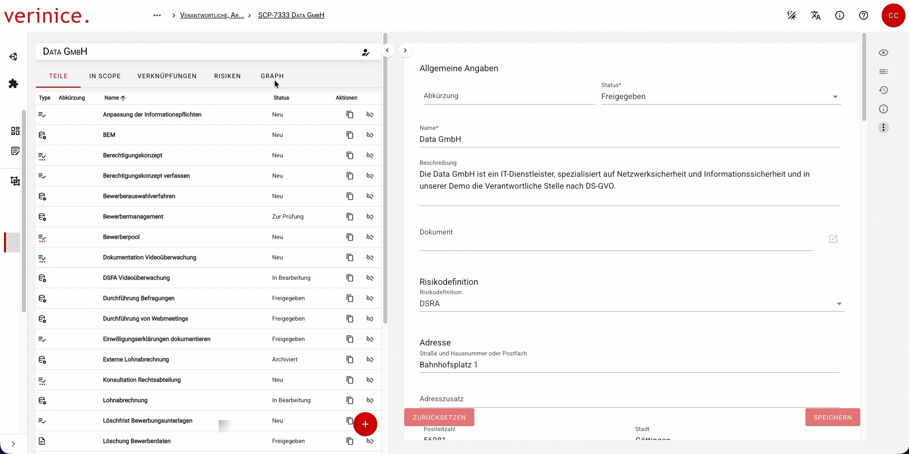
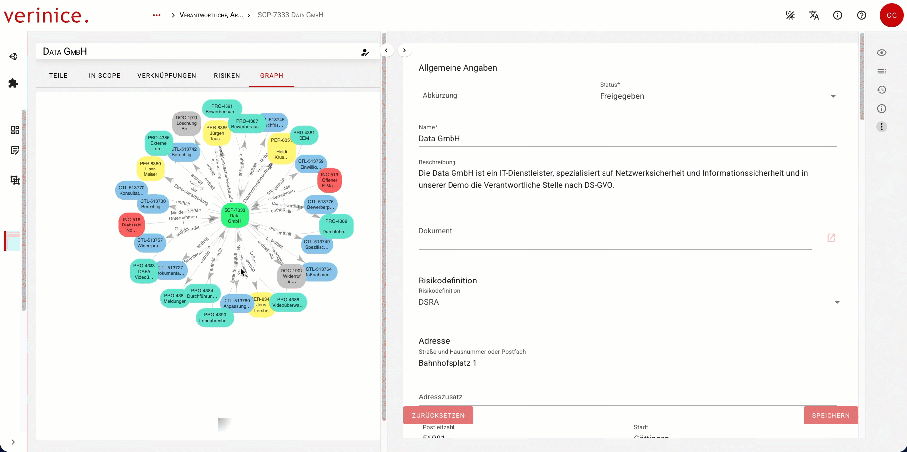
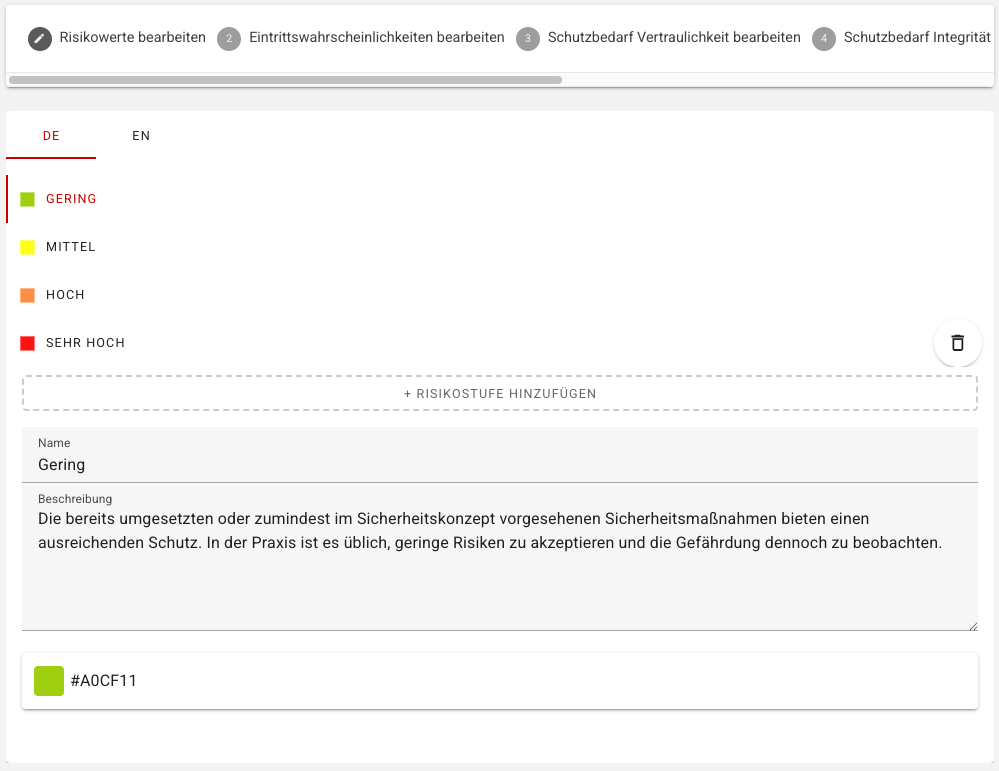
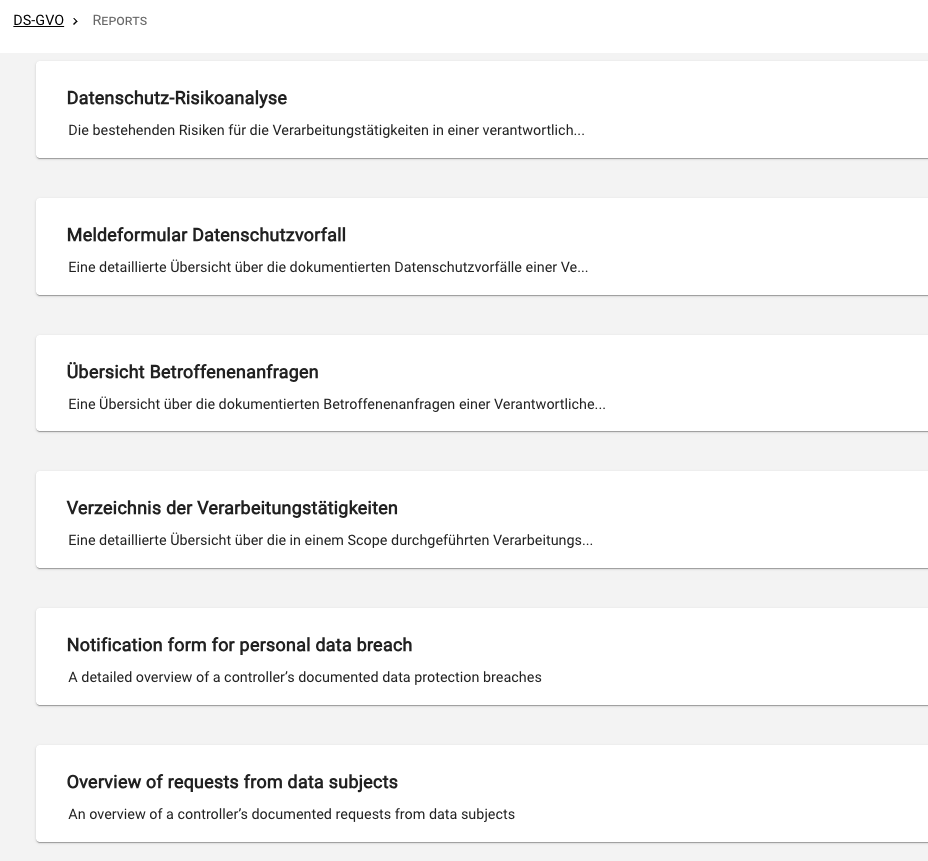

<!-- © 2026 The Project Contributors - see AUTHORS.txt -->
# verinice 49

Die folgenden Neuerungen stehen Anwenderinnen und Anwendern mit dem Release von verinice 49 zur Verfügung.

## Visuelle Darstellung von Verknüpfungen
<!--&225-->
Die erste Iteration der visuellen Darstellung der Verknüpfungen ermöglicht die Navigation zu direkten *Nachbarn* :





## Änderung der Risikodefinition verbessern
<!--301-->
Das **Löschen** *mittlerer Stufen* von Auswirkung, Eintrittswahrscheinlichkeit oder Risikowerten in einer Risikodefinition führt zu Verschiebungen von Risikowerten in bereits bestehenden Risiken und erfordert manuelle Nacharbeiten. Um das unbeabsichtigte Löschen zu vermeiden, kann nur noch die jeweils höchste Stufe gelöscht werden. Die Umbenennung aller Stufen ist nach wie vor möglich.



::: danger Jede Anpassung einer Risikodefinition bedingt Änderungen an bereits bestehenden Risiken. Es ist empfohlen, die Risikodefinition **vor**  der Risikobewertung auf die jeweilige Organisation anzupassen!
:::

Darüber hinaus wurden folgende Fehler behoben: 
- Das Frontend berücksichtigt, dass eine Risikodefinition mindesten ein Kriterium (Schutzziel) enthalten muss.
- Eine Risikodefinition kann jetzt gespeichert werden, wenn eine Risikostufe gelöscht wird, sofern diese in keiner Matrix mehr verwendet wird.

## Reports als Karten
<!--&240-->
Reports werden in separaten Karten je Sprachvariante dargestellt, um die Auswahl zu vereinfachen:


## Detailverbesserungen und Fehlerbehebungen <Badge type="info">Test</Badge>
<!--&264, &186-->
- Die Dokumentation für das Berechtigungsmanagement wurde aktualisiert. 
- Der Report **A.3 Modellierung** in der Domäne IT-Grundschutz (DE) liest die neue Property ```complianceControlSubTypes``` aus.
- Die veraltete Property ```complianceControlSubType``` wurde entfernt (zuvor abgelöst von ```complianceControlSubTypes```).
- Behebung des 404-Fehler (Objekt nicht gefunden) unter **Meine zuletzt bearbeiteten Objekte**, wenn das Objekt in einer anderen Domäne erzeugt wurde.
- Der Inhalt des IT-Grundschutz-Kompendiums und anderer Controls im Umsetzungsdialog ist jetzt auch im Dunkel-Modus (Darkmode) lesbar.
- Anzeige fehlender Übersetzungen bei Profilen im **Unit erstellen** Wizard.
- An den Report-Service werden Standardbenutzer und Standardpasswort des angemeldeten Benutzers übergeben.
- Upgrade auf VueQuery Version 5.
- Update auf Cypress 15
- Update vue-tsc auf v3.1.8
