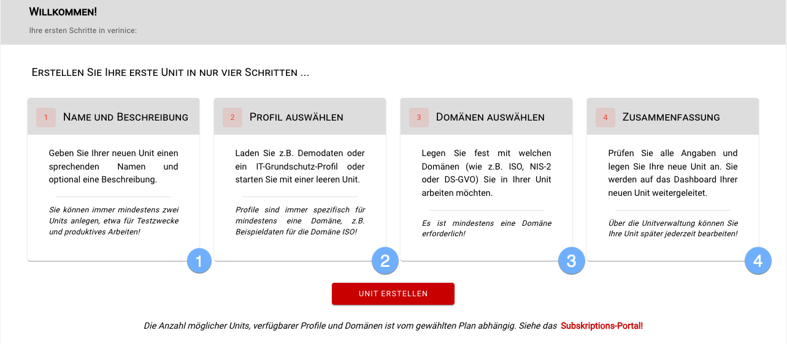
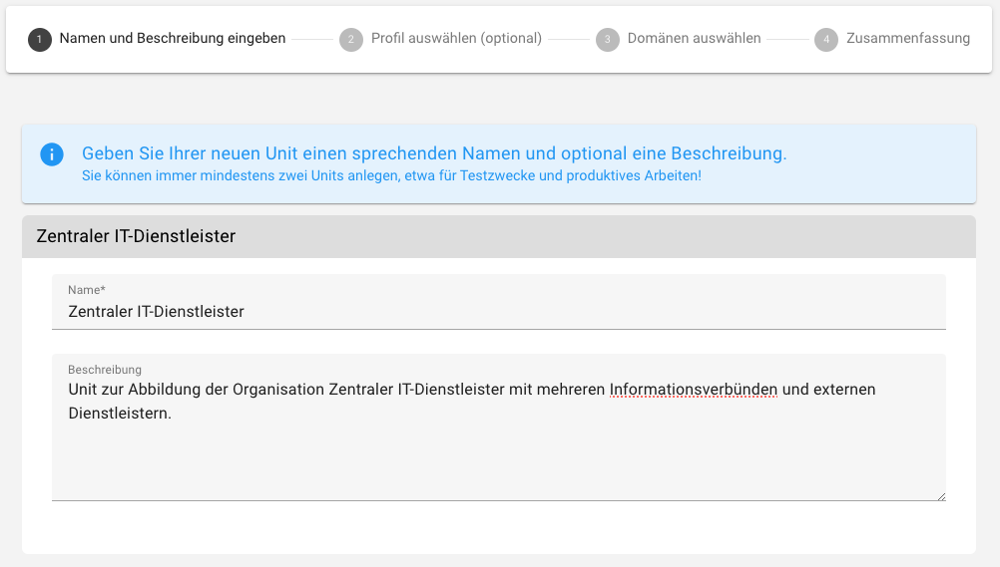
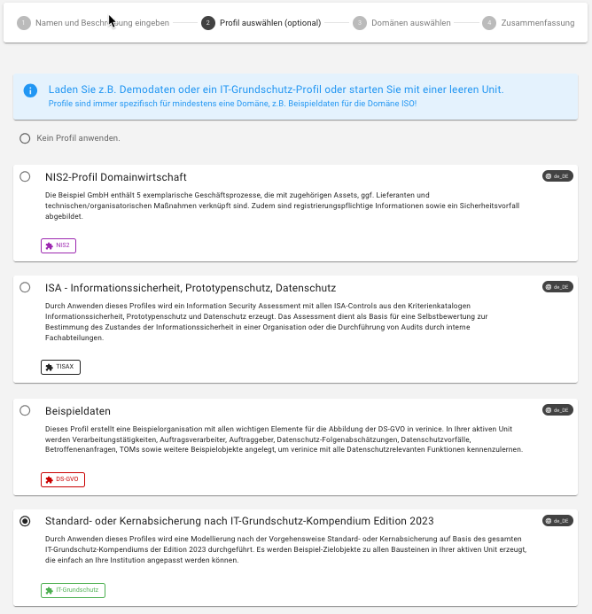
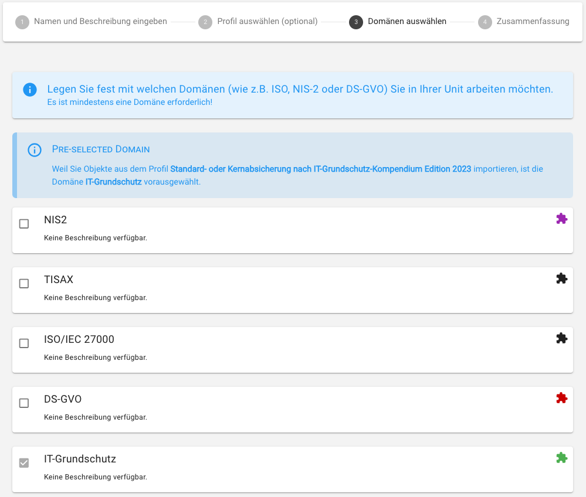
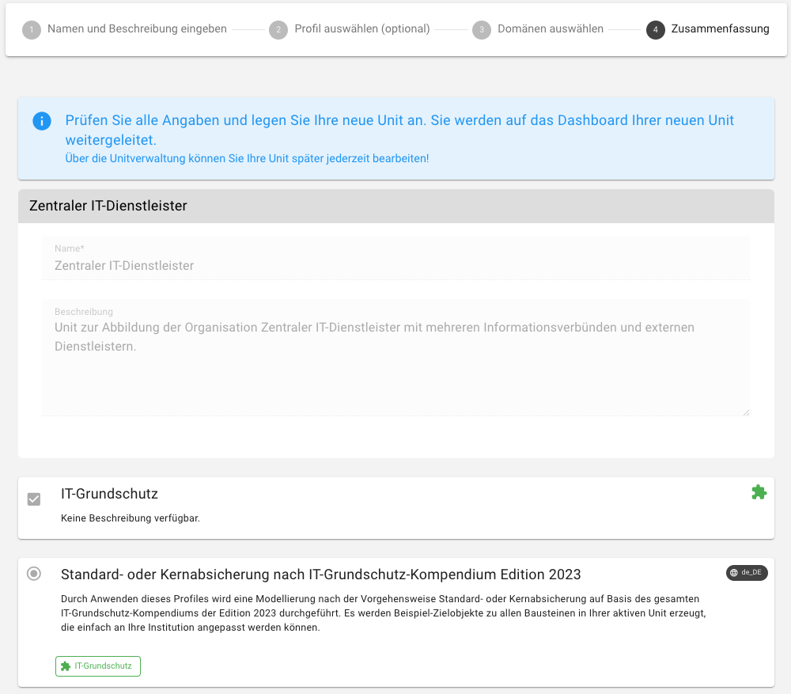
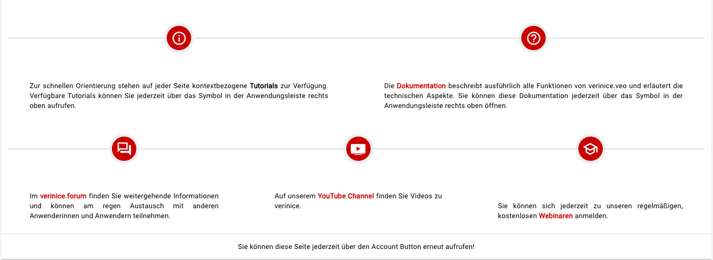

<!-- © 2024 The Project Contributors - see AUTHORS.txt -->
# First steps

After logging in for the first time, you will be taken to the **First steps** page, where a wizard will help you with the initial **creation of a unit**:

1. create a [unit](../object-model/objects#unit) in which you map your organization or institution:

2. optionally select a [profile](../object-model/profiles.md), which creates objects in your new unit as a template. Profiles are specific to (at least) one domain, e.g. **Sample data** for the GDPR domain, an **IT-Grundschutz profile** for the IT-Grundschutz domain or the **Risk catalog** for the ISO domain. You can add (further) **profiles** to your unit at any time via the [unit management](unit-management) and start with an empty unit.

3. specify which [domains](../object-model/domains.md) you want to work with in your unit. At least one domain must be selected! You can add further domains to your unit at any time via the [unit management](unit-management):

4. if the selected details are correct, confirm the creation of your first unit:

Once the unit has been successfully created, you will be redirected to the [Dashboard](user-interface#dashboard) of the unit.
The **First steps** page summarizes further sources of information; you can call up the page again at any time using the **Account button**.

