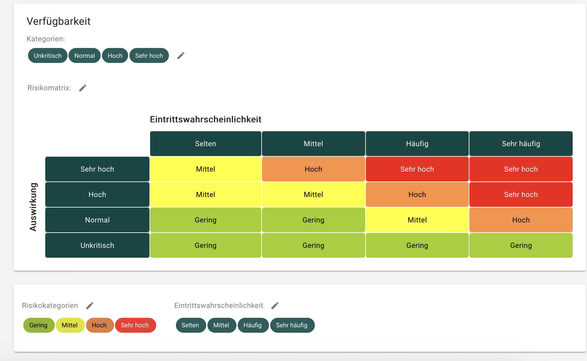
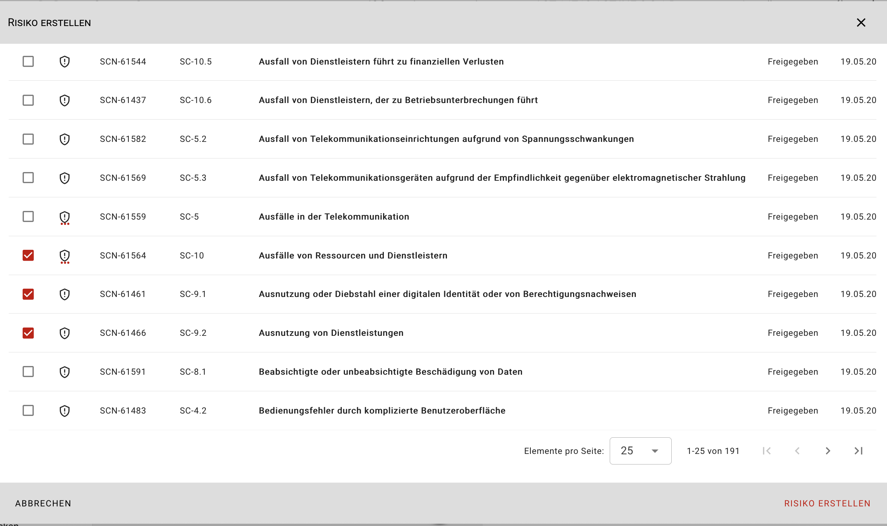
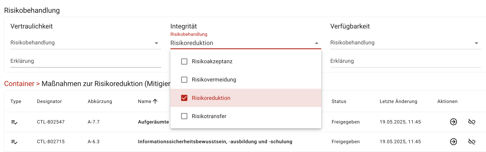
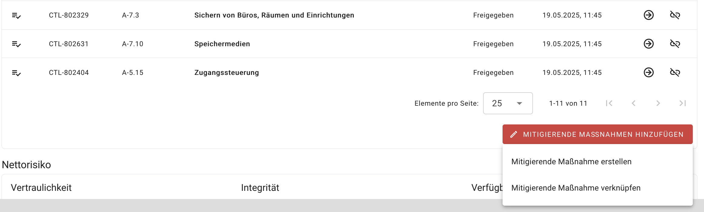
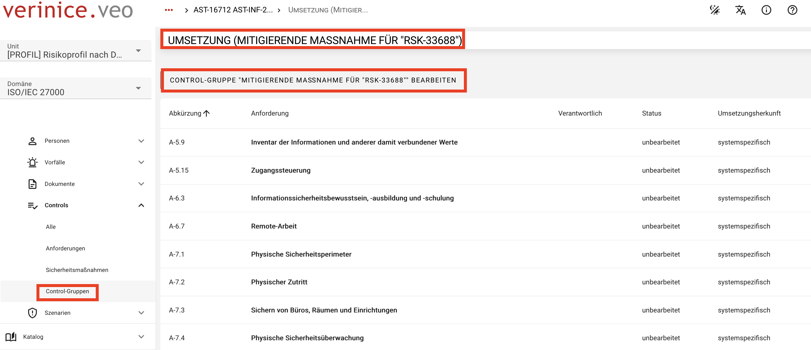
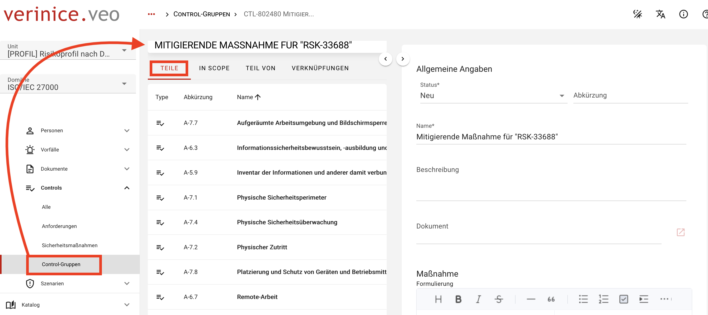
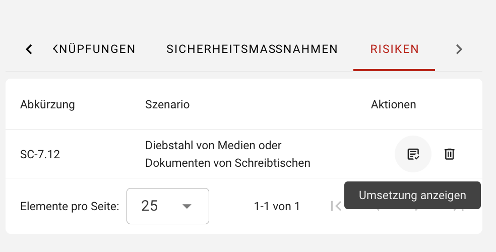
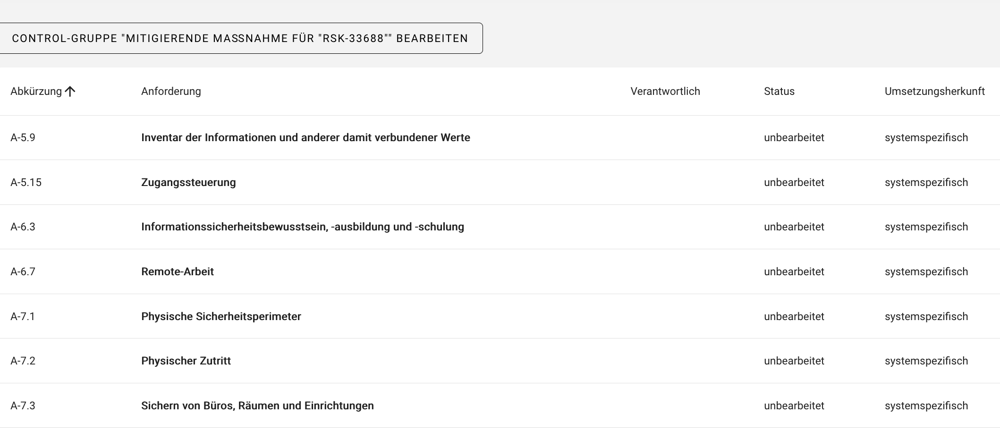
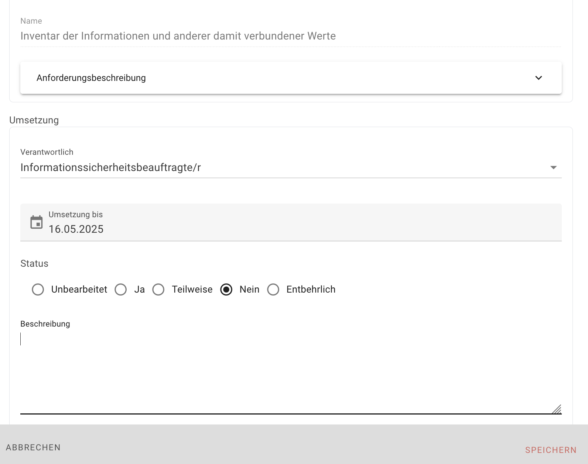

<!-- © 2024 The Project Contributors - see AUTHORS.txt -->
# Risikomanagement

## Risikodefinition

Im Abschnitt **Risikodefinition** werden die Parameter für die Risikomatrix festgelegt. Navigieren Sie dazu im Menü zu **Risikodefinitionen** und anschließend **ISORA**. Hier können Sie mit einem **Klick auf das Stift-Symbol** Name, Definition und Farbe der Parameter Schadensauswirkung, Eintrittswahrscheinlichkeit und Risikokategorie modifizieren.

## Risikoanalyse

Es besteht die Möglichkeit, für sämtliche Scope-, Asset- sowie Prozess-Objekte eine Risikoanalyse durchzuführen. Hierfür gehen Sie bitte folgendermaßen vor: 

- Wählen Sie für das betroffene Objekt, z.B Assets, im Objektumfeld den Tab-Reiter **Risiken**.
- Über das rote **Plus-Icon** können Sie nun für Ihr Asset ein **Risiko** hinzufügen.

[Risiko hinzufügen](../assets/domain-iso/verinice-39-add-risk.de.png)

- Treffen Sie eine passende Auswahl aus den Szenarien.

Bei der Auflistung handelt es sich um die aus dem Katalog auf Ihre Unit manuell angewandten Szenarien. Zudem haben Sie die Möglichkeit, eigene individuelle Szenarien als Objekte über das Formular **Szenarien** anzulegen, um diese für Ihre Risikoanalyse zu verwenden.

## Risikobewertung

Um die einzelnen Risiken bearbeiten zu können, klicken Sie auf das entsprechende Risiko. Im sich öffnenden **Risikodialog** kann einen spezifische Risikobewertung vorgenommen werden. Bewerten Sie hierzu folgende Parameter:

- **Eintrittswahrscheinlichkeit** (und gegebenenfalls eine Erklärung)
- **Schadensauswirkung** pro Schutzziel (und gegebenenfalls eine Erklärung)

Aus diesen beiden Werten wird, nachdem Sie Ihre Eingaben gespeichert haben, das **Bruttorisiko** anhand der Risikomatrix berechnet.

## Risikobehandlung

Für die Risikobehandlung stehen Ihnen die Optionen 

- Risikovermeidung
- Risikoreduktion
- Risikotransfer
- Risikoakzeptanz

zur Verfügung, die jeweils mit einem Textfeld zwecks Erklärungen ausgestattet sind. 

Bei gewählter Risikobehandlungsoption **Risikoreduktion** kann das Risiko durch Hinzufügen **Mitigierender Maßnahmen** reduziert werden.

verinice bietet Ihnen zwei Möglichkeiten **Mitigierende Maßnahmen** zu hinterlegen:

### Mitigierende Maßnahme erstellen

Um eine **neue Maßnahmen** zu erstellen klicken Sie **Mitigierende Maßnahmen hinzufügen** und anschließend **Mitigierende Maßnahme erstellen**. Es öffnet sich ein Dialog, um die neue Maßnahme zu erstellen. Nachdem Sie Ihre Daten zur Maßnahme gespeichert haben, wird die neue Maßnahme im vorherigen Risikodialog im Bereich **Maßnahmen zur Risikoreduktion** angezeigt.

### Mitigierende Maßnahme verknüpfen

Sie können auch **Mitigierende Maßnahmen** hinzufügen, indem Sie bereits **vorhandene Maßnahmen** verknüpfen. Die vorhandenen Sicherheitsmaßnahmen stammen entweder aus dem Katalog, durch Anwenden der einschlägigen Sicherheitsmaßnahmen, oder sind individuell formulierte Maßnahmen, die als Objekte über das Formular **Sicherheitsmaßnahmen** angelegt wurden.

Über die Funktion **Mitigierende Maßnahmen hinzufügen** und anschließend **Mitigierende Maßnahmen verknüpfen**, können Sie eine Auswahl aus den bereits erfassten Sicherheitsmaßnahmen für die Mitigation treffen. Nach Speicherung werden die von Ihnen ausgewählten Objekte im Bereich **Maßnahmen zur Risikoreduktion** aufgelistet.

Abschließend muss das Nettorisiko und eine Erklärung gesetzt werden. Denken Sie bitte daran, den Risikodialog zu speichern und zu schließen.

::: info Für die zu einem Risiko zugehörigen mitigierenden Maßnahmen wird im Hintergrund stets eine Control-Gruppe erzeugt.
:::

## Mitigierende Maßnahmen bearbeiten

Um **Mitigierende Maßnahmen** zu bearbeiten, navigieren Sie im Objektumfeld des betroffenen Zielobjektes zum Tab-Reiter **Risiken**. Hier werden die im Vorfeld identifizierten Risiken angezeigt. Über die Funktion **Umsetzung anzeigen** gelangen Sie zur Übersicht sämtlicher mitigierender Maßnahmen für das ausgewählte Risiko. 

Hier können Sie nun jede einzelne Sicherheitsmaßnahme mit Klick auf die jeweilige Maßnahme bearbeiten. In dem sich öffnenden Umsetzungsdialog können folgende Informationen eingesehen bzw. eingepflegt werden:

- Informationen zum Zielobjekt 
- Angaben zur Sicherheitsmaßnahme wie z.B Controlbeschreibung, Maßnahmenart usw.
- Informationen zur Umsetzung: 
  - Verantwortliche Person
  - Umsetzung bis (Datum)
  - Umsetzungsstatus (Unbearbeitet, Ja, Teilweise, Nein, Entbehrlich)
  - Umsetzungsbeschreibung

Nachdem Sie die Daten eingetragen haben, schließen Sie den Dialog mit **Speichern**.
