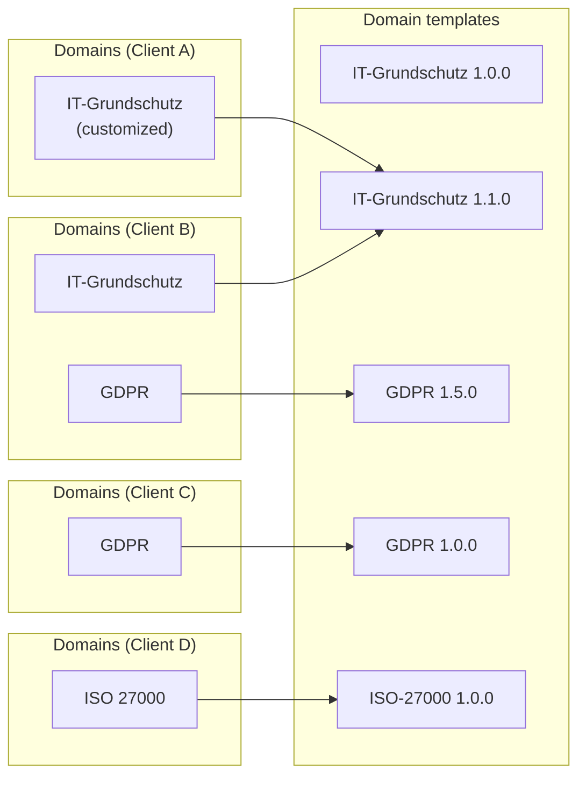
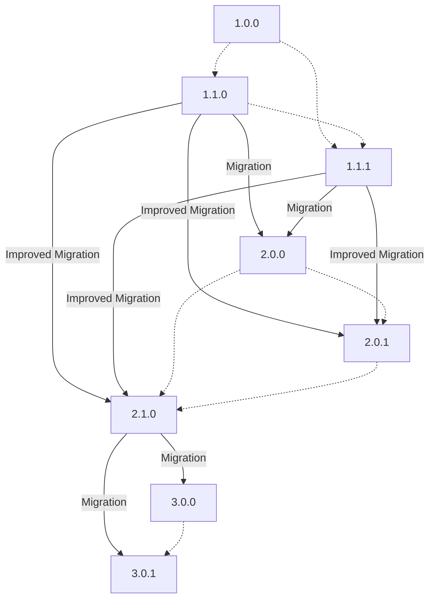

<!-- © 2025 The Project Contributors - see AUTHORS.txt -->

# Domain templates

::: warning Warning

The behavior described here regarding domain updates is not yet given in the current version of verinice.
Currently, domain updates are still triggered by the respective platform operators and not by the main users as described here.
:::

**Domain templates** are centrally defined in a verinice instance.
They are generally available to all [clients](objects.md#client).
They are templates from which [domains](domains.md) can be generated, with which a user may work within their client.
Domain templates are [versioned](#versioning).

When a shop user (in the verinice-cloud) or administrator (in an onprem instance) creates a client, they define which domain templates are to be copied into the client as domains.
The main user of the client can customize their domains and later has the possibility to [update](#domain-update) their client to newer template versions.
The cloud buyer or onprem administrator can also subsequently copy additional domain templates into the existing client.

::: info Example

The diagram shows how the available domain templates are used in various clients in a verinice instance.
The templates "IT-Grundschutz" and "GDPR" are both available in two different versions.

- **Client A** uses a domain created from the template "IT-Grundschutz 1.1.0". The main user has adapted its domain to specific needs in its organization.

- The domains of **Client B** are based on the templates "IT-Grundschutz 1.1.0" and "GDPR 1.5.0".

- **Client C** contains an unmodified domain based on the template older "GDPR 1.0.0". The main user has not updated their client to the newer template version yet.

- **Client D** contains an unmatched domain based on the template "ISO&nbsp;27000".
:::

## Versioning

Domain templates are immutable.
Whenever a content creator wants to publish a revised domain, a new domain template with a higher version number must be created.
The old version of the domain template remains unaffected and can potentially continue to be used.

Domain templates are versioned according to [Semantic Versioning 2.0.0](https://semver.org).

* **Patch** versions must not make any structural changes. Effectively, only translations can be changed.
* **Minor** versions may expand the structure, but make **no** breaking changes. For example, new [aspects](domains.md#aspects) may be added, but no existing ones may be adjusted or removed.
* **Major** versions can change everything and are reserved for breaking changes.

If a new minor or major version has been released, hotfixes can continue to be released as new patch releases for the legacy version.
However, after the release of a new major version, new features cannot be added retrospectively as minor updates for the legacy version.

:::info Example

The content creators have created a new major version 4.0.0 for a standard, based on the current domain template version 3.6.2.
Some users immediately migrate to 4.0.0 while others continue working with older versions.
Now a typo is discovered that affects both versions.
The content creators can now fix the typo for the new and the old major version, and release these corrections as patches 3.6.3 and 4.0.1.

Finally, the content creators come up with new [aspects](domains#aspects) for the standard.
They can now publish them in a new minor version 4.1.0, but it is not technically possible to publish the new aspects as an update for the 3.\*.\* versions.
Users of the 3.\*.\* versions must therefore migrate to version 4.1.0 to use the new aspects.
:::

## Domain update

If a main user uses an older version of a domain in their client, they can continue working with that version until they decide to update their client to a newer domain template version.
During the domain update, the new domain template is copied into its client as a domain and all [objects](objects) associated with the old domain version are transferred to this new version.
Normally, the existing data are transferred one-to-one and the user does not have to intervene in the update, but in some cases a migration of the data is required.

### Migration

Domains contain dynamic data structures (such as [aspects](domains#aspects)) and thus define validation rules for objects associated with the domain.
If these data structures change so that these validation rules become stricter, this is considered a **breaking change**.
This is the case, for example, when the data type or the technical key of an aspect attribute changes.

A domain template that contains breaking changes is always released as a major update and contains migration steps to help users migrate their existing data.
A migration step contains a human-readable description of the change and optionally defines a machine-readable migration instruction.

If a main user encounters a major update in their client, the application tries to transfer all objects in the client into the new version and execute the defined migration instructions automatically.
At the end of this operation all objects are valid according to the rules of the new domain version.
If all objects are valid, then the update is already successfully completed.
However, if any objects should be invalid at this point, the entire update is rolled back.
The user must then manually adjust all objects that could not be migrated automatically, and finally restart the update.

### Update paths

Generally, it is possible for a main user to update their domain to any higher template version.
However, each major version contains important migration steps and must not be skipped.
An update to the next higher major version is always possible, but not directly to the major version after the next major version.

::: info Example

Suppose there are the following versions of a template:

| Version | Release notes                                             | included migration steps |
|---------|-----------------------------------------------------------|--------------------------|
| 1.0.0   | first version                                             | none                     |
| 1.1.0   | new aspect added                                          | none                     |
| 1.1.1   | typing errors in translation fixed                        | none                     |
| 2.0.0   | breaking Change: Data type of an aspect attribute changes | 1.1.* → 2.0.0            |
| 2.0.1   | improved migration steps                                  | 1.1.* → 2.0.1            |
| 2.1.0   | new link added                                            | 1.1.* → 2.1.0            |
| 3.0.0   | aspect is deleted                                         | 2.1.* → 3.0.0            |
| 3.0.1   | typing errors in translation fixed                        | 2.1.* → 3.0.1            |

The following updates are supported, with only major updates requiring migration:

A direct update from 1.\*.\* to 3.\*.\* is not possible because there are no migration steps for this operation.
A user can only update to 2.\*.\*, and from there to 3.\*.\*.
:::