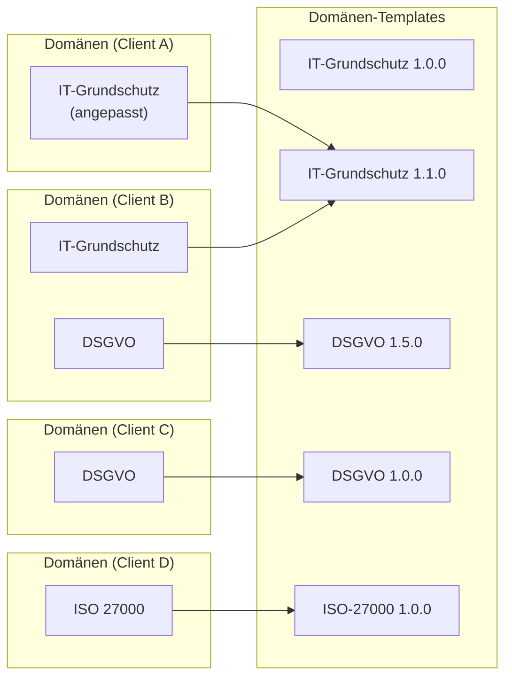
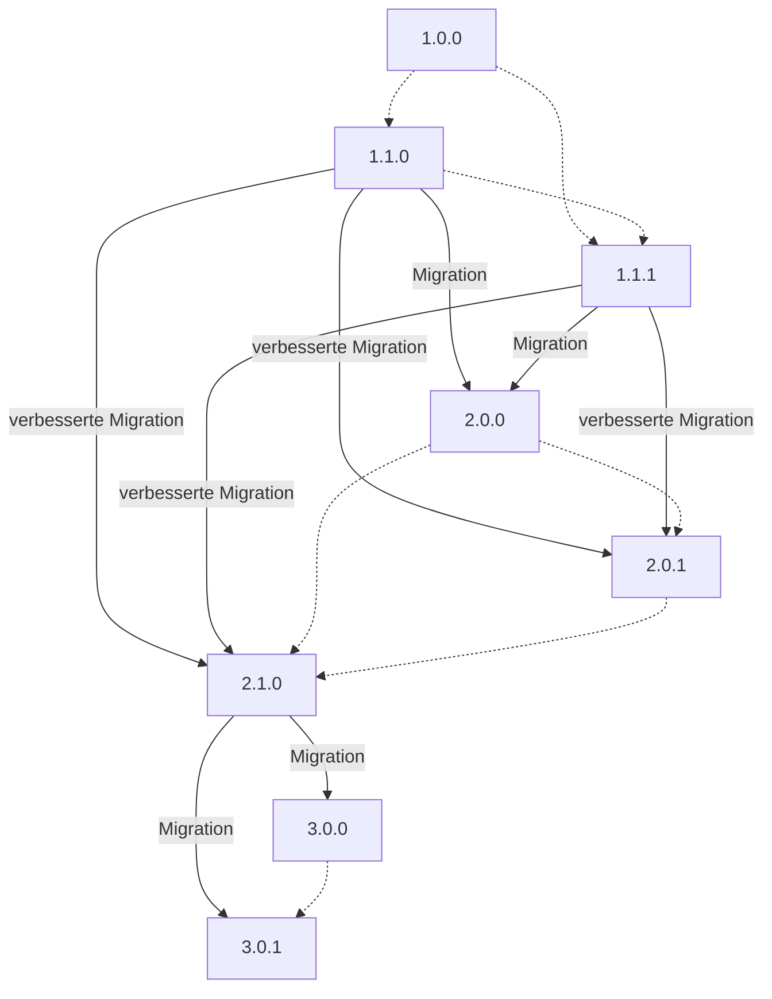

<!-- © 2025 The Project Contributors - see AUTHORS.txt -->

# Domänen-Templates

::: warning Warnung

Das hier beschriebenen Verhalten bezüglich Domänen-Updates ist in der aktuellen Version von verinice so noch nicht gegeben.
Derzeit werden Domänen-Updates noch von den jeweiligen Plattformbetreibern ausgelöst und nicht wie hier beschrieben von den Hauptbenutzern.
:::

**Domänen-Templates** sind in einer verinice-Instanz zentral definiert.
Sie stehen grundsätzlich allen [Clients](objects.md#client) zur Verfügung.
Es handelt sich dabei um Vorlagen, aus denen [Domänen](domains.md) erzeugt werden können, mit denen ein Anwender dann innerhalb seines Clients arbeiten kann.
Die Domänen-Templates sind [versioniert](#versionierung).

Wenn ein Shop-Benutzer (in der verinice-cloud) oder ein Administrator (in einer onprem-Umgebung) einen Client anlegt, legt er fest, welche Domänen-Templates als Domänen in den Client kopiert werden sollen.
Die Hauptnutzerin des Clients kann ihre Domänen anpassen und hat später die Möglichkeit, ihren Client auf neuere Template-Versionen zu [updaten](#domänen-update).
Der onprem-Administrator oder cloud-Einkäufer kann auch nachträglich weitere Domänen-Templates in den bestehenden Client kopieren. 

::: info Beispiel

Das Diagramm zeigt, wie in verschiedenen Clients in einer verinice-Instanz mit den verfügbaren Domänen-Templates gearbeitet wird.
Die Templates "IT-Grundschutz" und "DSGVO" liegen jeweils in zwei unterschiedlichen Versionen vor.

- In **Client A** wird eine Domäne benutzt, die aus dem Template "IT-Grundschutz 1.1.0" erzeugt wurde. Der Hauptbenutzer hat seine Domäne an spezielle Bedürfnisse in seiner Organisation angepasst.

- Die Domänen von **Client B** basieren auf den Templates "IT-Grundschutz 1.1.0" und "DSGVO 1.5.0".

- **Client C** enthält eine unmodifizierte Domäne basierend auf dem Template älteren "DSGVO 1.0.0". Das Update auf die neuere Template-Version hat die Hauptnutzerin noch nicht durchgeführt.

- **Client D** enthält eine unangepasste Domäne basierend auf dem Template "ISO&nbsp;27000".
  :::

## Versionierung

Domänen-Templates sind unveränderbar.
Immer, wenn ein Content Creator eine überarbeitete Domäne veröffentlichen will, muss daraus ein neues Domänen-Template mit einer höheren Versionsnummer erstellt werden.
Die alte Version des Domänen-Templates bleibt davon unberührt und kann potenziell weiterhin verwendet werden.

Domänen-Templates werden nach [Semantic Versioning 2.0.0](https://semver.org) versioniert.

* **Patch**-Versionen dürfen keinerlei Strukturänderungen machen. Hier dürfen effektiv nur Übersetzungen geändert werden.
* **Minor**-Versionen dürfen die Struktur erweitern, aber **keine** Breaking Changes machen. So dürfen z.B. neue [Aspekte](domains.md#aspekte) hinzugefügt, aber keine bestehenden angepasst oder entfernt werden.
* **Major**-Versionen dürfen alles ändern und sind für Breaking Changes reserviert.

Wurde eine neue Minor- oder Major-Version veröffentlicht, so können für die Vorversion weiterhin Hotfixes als neue Patch-Releases erscheinen.
Nach dem Erscheinen einer neuen Major-Version können jedoch für die Vorversion keine neuen Features mehr nachträglich als Minor herausgebracht werden.

:::info Beispiel

Die Content-Creators haben für einen Standard auf Basis der aktuellen Domänen-Template-Version 3.6.2 eine neue Major-Version 4.0.0 erstellt.
Manche Anwenderinnen migrieren sofort auf die 4.0.0, während andere mit älteren Versionen weiterarbeiten.
Nun wird ein Tippfehler entdeckt, der beide Versionen betrifft.
Den Typo können die Content-Creators nun für die neue und die alte Major beheben, und diese Korrekturen als Patches 3.6.3 und 4.0.1 herausbringen.

Schließlich denken sich die Content-Creators neue [Aspekte](domains.md#aspekte) für den Standard aus.
Diese können sie nun in einer neuen Minor-Version 4.1.0 veröffentlichen, aber es ist technisch nicht möglich, die neuen Aspekte als Update für die 3.\*.\*-Versionen nachzureichen.
Nutzer der 3.\*.\*-Versionen müssen also erst auf Version 4.1.0 migrieren, um die neuen Aspekte nutzen zu können.
:::

## Domänen-Update

Verwendet ein Hauptnutzer eine ältere Version einer Domäne in seinem Client, dann kann er so lange mit diesem Stand weiterarbeiten, bis er sich zum Domänen-Update entschließt.
Beim Domänen-Update wird das neue Domänen-Template als Domäne in seinen Client kopiert und alle mit der alten Domänen-Version assoziierten [Objekte](objects.md#fachobjektek) werden in diese neue Version überführt.
Normalerweise werden die bestehenden Daten 1:1 übernommen und der Anwender muss nicht in das Update eingreifen, aber in einigen Fällen ist eine Migration der Daten erforderlich.

### Migration

Domänen enthalten dynamische Datenstrukturen (wie z.B. [Aspekte](domains.md#aspekte)) und definieren somit Validierungsregeln für Objekte, die mit der Domäne assoziiert sind.
Ändern sich diese Datenstrukturen so, dass diese Validierungsregeln strenger werden, dann ist von einem **Breaking Change** die Rede.
Dies ist z.B. der Fall, wenn sich bei einem Aspektattribut der Datentyp oder der technische Key ändern.

Ein Domänen-Template, das Breaking Changes enthält, erscheint immer als Major-Update und enthält Migrationsschritte, die den Anwendern beim Domänen-Update dabei helfen sollen, ihre bestehenden Daten zu migrieren.
Ein Migrationsschritt enthält eine menschenlesbare Beschreibung der Änderung und definiert ggf. eine maschinenlesbare Migrationsanweisung.

Stößt eine Hauptnutzerin in ihrem Client ein Major-Update an, so versucht die Anwendung, alle Objekte im Client in die neue Version zu überführen und dabei die hinterlegten Migrationsanweisungen automatisch auszuführen.
Am Ende dieser Operation werden alle Objekte nach den Regeln der neuen Domäne-Version validiert.
Sind sie gültig, dann ist das Update somit bereits erfolgreich abgeschlossen.
Sind jedoch an diesem Punkt Objekte invalide, so wird das gesamte Update zurückgerollt.
Die Anwenderin muss nun die nicht automatisch migrierbaren Objekte manuell anpassen und im Anschluss das Update erneut anstoßen.

### Update-Pfade

Grundsätzlich ist es als Hauptnutzer möglich, eine Domäne auf jede höhere Template-Version zu updaten.
Allerdings bringt jede Major-Version wichtige Migrationsschritte mit sich und darf nicht übersprungen werden.
Es lässt sich immer auf die nächsthöhere Major-Version updaten, aber nicht direkt auf die übernächste.

::: info Beispiel

Angenommen, es gibt die folgenden Versionen eines Templates:

| Version | Release notes                                                 | enthaltene Migrationsschritte |
|---------|---------------------------------------------------------------|-------------------------------|
| 1.0.0   | erste Version                                                 | keine                         |
| 1.1.0   | neuer Aspekt hinzugefügt                                      | keine                         |
| 1.1.1   | Tippfehler in Übersetzung gefixt                              | keine                         |
| 2.0.0   | Breaking Change: Datentyp eines Aspekt-Attributes ändert sich | 1.1.* → 2.0.0                 |
| 2.0.1   | verbesserte Migrationsschritte                                | 1.1.* → 2.0.1                 |
| 2.1.0   | neue Verknüpfung hinzugefügt                                  | 1.1.* → 2.1.0                 |
| 3.0.0   | Aspekt wird gelöscht                                          | 2.1.* → 3.0.0                 |
| 3.0.1   | Tippfehler in Übersetzung gefixt                              | 2.1.* → 3.0.1                 |

So werden die folgenden Updates unterstützt, wobei nur Major-Updates eine Migration erfordern:

Ein direktes Update von 1.\*.\* auf 3.\*.\* ist nicht möglich, da es dafür keine Migrationsschritte gibt.
Es lässt sich aber erst auf 2.\*.\* updaten und von dort aus dann auf 3.\*.\*.
:::